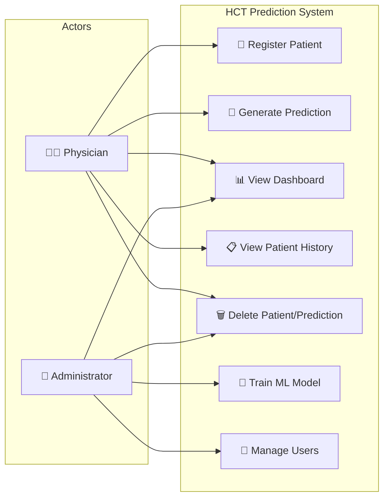
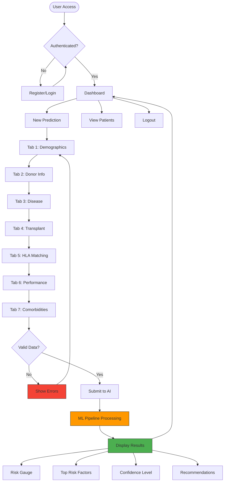
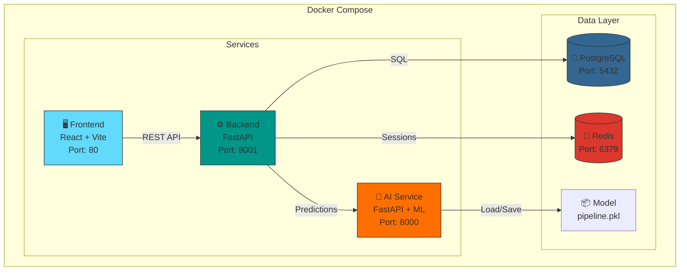
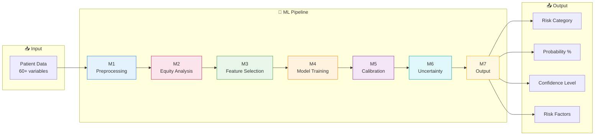

# HCT Survival Prediction System

## Post-Hematopoietic Cell Transplant Survival Prediction System

---

## 📋 Executive Summary

This system predicts the probability of 100-day survival post-hematopoietic cell transplant (HCT), helping physicians make informed decisions about treatment for patients with hematological diseases.

### Key Features
- **Risk Prediction**: Classifies patients into Low/Medium/High risk
- **60+ Clinical Variables**: Incorporates demographics, donor, disease, HLA, comorbidities
- **Intuitive Web Interface**: Guided form with real-time validation
- **Modular Architecture**: 7 AI modules with equity focus
- **Persistent Database**: PostgreSQL for secure storage

---

## 👥 Use Cases



### Use Case Descriptions

| Use Case | Actor | Description |
|----------|-------|-------------|
| **Register Patient** | Physician | Enter 60+ clinical variables across 7 form tabs |
| **Generate Prediction** | Physician | Submit patient data to ML model, receive risk assessment |
| **View Dashboard** | Both | See statistics, recent predictions, high-risk cases |
| **View Patient History** | Physician | Access all patients and their prediction history |
| **Delete Patient/Prediction** | Both | Remove patient records or specific predictions |
| **Train ML Model** | Admin | Retrain model with updated data |
| **Manage Users** | Admin | Create, modify, deactivate user accounts |

---

## 🔄 User Flow



---

## 🏗️ System Architecture



### Components

| Component | Technology | Port | Function |
|-----------|------------|------|----------|
| Frontend | React + Vite | 80 | User interface |
| Backend | FastAPI + SQLAlchemy | 8001 | REST API, authentication, business logic |
| AI Service | FastAPI + Scikit-learn | 8000 | ML pipeline, predictions |
| Database | PostgreSQL 15 | 5432 | Persistent storage |
| Cache | Redis 7 | 6379 | Sessions and cache |

---

## 🧠 Machine Learning Pipeline

The system implements a 7-module architecture based on healthcare ML best practices:



### M1: Data Preprocessing (`m1_preprocessing.py`)
- **Function**: Data loading, validation, and imputation
- **Techniques**: 
  - Demographic-aware imputation
  - Categorical variable encoding
  - Numerical variable normalization
- **Output**: Clean DataFrame ready for modeling

### M2: Equity Analysis (`m2_equity.py`)
- **Function**: Detect and mitigate demographic biases
- **Techniques**:
  - Sample weight calculation by racial group
  - Outcome disparity analysis
- **Output**: Equity weights for training

### M3: Feature Selection (`m3_features.py`)
- **Function**: Identify most predictive variables
- **Techniques**:
  - Permutation importance
  - Outcome correlation
  - **Forced comorbidities**: Always includes all 14 comorbidities
- **Output**: List of 45 selected features

### M4: Predictive Modeling (`m4_models.py`)
- **Function**: Train classification models
- **Available Models**:
  - **GBM** (Gradient Boosting Machine) - Default
  - Random Forest
  - Ensemble (combination)
- **Validation**: 5-fold stratified cross-validation
- **Metrics**: AUC-ROC ~0.74, Accuracy, Precision, Recall

### M5: Fairness Calibration (`m5_calibration.py`)
- **Function**: Adjust predictions for equity across groups
- **Techniques**:
  - Isotonic calibration by group
  - Threshold adjustment
- **Output**: Calibrated model with reduced disparity

### M6: Uncertainty Quantification (`m6_uncertainty.py`)
- **Function**: Estimate prediction confidence
- **Techniques**:
  - Bootstrap confidence intervals
  - Reliability score
- **Output**: [lower, upper] intervals for each prediction

### M7: Output Generation (`m7_outputs.py`)
- **Function**: Produce interpretable results
- **Outputs**:
  - Event probability (0-100%)
  - Risk category (Low/Medium/High)
  - Confidence level (high/moderate/borderline)
  - Top risk factors (SHAP values)

---

## 📊 Clinical Variables

The model uses **60+ variables** organized into categories:

### Patient Demographics
| Variable | Description | Type |
|----------|-------------|------|
| `age_at_hct` | Age at transplant | Numeric (0-120) |
| `race_group` | Racial/ethnic group | Categorical |
| `ethnicity` | Ethnicity | Categorical |
| `year_hct` | Year of transplant | Numeric |

### Donor Information
| Variable | Description | Type |
|----------|-------------|------|
| `donor_age` | Donor age | Numeric |
| `donor_related` | Donor type (MSD/MUD/Haplo/Auto) | Categorical |
| `sex_match` | Sex match | Categorical |

### Disease
| Variable | Description | Type |
|----------|-------------|------|
| `prim_disease_hct` | Primary disease | Categorical (AML, ALL, MDS, etc.) |
| `dri_score` | Disease risk index | Categorical (Low/Intermediate/High/Very High) |
| `cyto_score` | Cytogenetic score | Categorical |
| `mrd_hct` | Minimal residual disease | Categorical |

### Transplant
| Variable | Description | Type |
|----------|-------------|------|
| `conditioning_intensity` | Conditioning intensity | Categorical (MAC/RIC/NMA) |
| `graft_type` | Graft type | Categorical |
| `gvhd_proph` | GVHD prophylaxis | Categorical |
| `tbi_status` | Total body irradiation | Categorical |

### HLA Matching
| Variable | Description | Range |
|----------|-------------|-------|
| `hla_match_a_high` | HLA-A high resolution | 0-2 |
| `hla_match_b_high` | HLA-B high resolution | 0-2 |
| `hla_match_c_high` | HLA-C high resolution | 0-2 |
| `hla_match_drb1_high` | HLA-DRB1 high resolution | 0-2 |
| `hla_high_res_8` | 8 locus match | 0-8 |

### Performance Status
| Variable | Description | Range |
|----------|-------------|-------|
| `karnofsky_score` | Karnofsky score | 0-100 (multiples of 10) |
| `comorbidity_score` | Sorror score | 0-10 |

### Comorbidities (14 variables)
| Variable | Description |
|----------|-------------|
| `cardiac` | Cardiac condition |
| `arrhythmia` | Arrhythmia |
| `diabetes` | Diabetes |
| `hepatic_mild` | Mild hepatic |
| `hepatic_severe` | Severe hepatic |
| `pulm_moderate` | Moderate pulmonary |
| `pulm_severe` | Severe pulmonary |
| `renal_issue` | Renal problem |
| `obesity` | Obesity |
| `peptic_ulcer` | Peptic ulcer |
| `prior_tumor` | Prior tumor |
| `psych_disturb` | Psychiatric disturbance |
| `rheum_issue` | Rheumatologic problem |
| `vent_hist` | Mechanical ventilation history |

---

## 📖 Glossary of Medical Terms and Abbreviations

Understanding the clinical terminology is essential for proper data entry. Below is a comprehensive glossary of all terms used in the system.

### General Terms

| Term | Full Name | Description |
|------|-----------|-------------|
| **HCT** | Hematopoietic Cell Transplant | Procedure to replace damaged bone marrow with healthy stem cells |
| **CIBMTR** | Center for International Blood and Marrow Transplant Research | International research organization for transplant data |
| **Allogeneic** | From another person | Transplant using donor cells |
| **Autologous** | From self | Transplant using patient's own cells |

### Primary Diseases

| Abbreviation | Full Name | Description |
|--------------|-----------|-------------|
| **AML** | Acute Myeloid Leukemia | Cancer of myeloid cells in bone marrow; rapid onset |
| **ALL** | Acute Lymphoblastic Leukemia | Cancer of lymphoid cells; common in children |
| **MDS** | Myelodysplastic Syndrome | Bone marrow produces defective blood cells |
| **CML** | Chronic Myeloid Leukemia | Slow-growing cancer of myeloid cells |
| **CLL** | Chronic Lymphocytic Leukemia | Slow-growing cancer of lymphocytes |
| **NHL** | Non-Hodgkin Lymphoma | Cancer of lymphatic system (various types) |
| **HL** | Hodgkin Lymphoma | Lymphoma with Reed-Sternberg cells |
| **MM** | Multiple Myeloma | Cancer of plasma cells in bone marrow |

### Donor Types

| Abbreviation | Full Name | Description |
|--------------|-----------|-------------|
| **MSD** | Matched Sibling Donor | Fully HLA-matched brother or sister |
| **MUD** | Matched Unrelated Donor | HLA-matched donor from registry (non-family) |
| **MMUD** | Mismatched Unrelated Donor | Partially matched unrelated donor |
| **Haplo** | Haploidentical | Half-matched donor (parent, child, or sibling) |
| **UCB** | Umbilical Cord Blood | Stem cells from umbilical cord |
| **Auto** | Autologous | Patient's own cells (no donor) |

### Conditioning Regimens

| Abbreviation | Full Name | Description |
|--------------|-----------|-------------|
| **MAC** | Myeloablative Conditioning | High-dose chemo/radiation; destroys bone marrow completely |
| **RIC** | Reduced Intensity Conditioning | Lower doses; relies more on immune effect |
| **NMA** | Non-Myeloablative | Minimal doses; preserves some marrow function |
| **TBI** | Total Body Irradiation | Radiation to entire body as part of conditioning |

### Disease Risk and Status

| Abbreviation | Full Name | Description |
|--------------|-----------|-------------|
| **DRI** | Disease Risk Index | Composite score predicting disease-related mortality |
| **MRD** | Minimal Residual Disease | Small number of cancer cells remaining after treatment |
| **CR** | Complete Remission | No detectable disease |
| **PR** | Partial Remission | Disease reduced but still detectable |
| **Cytogenetics** | Chromosome analysis | Study of chromosomal abnormalities in cancer cells |

### HLA System

| Term | Full Name | Description |
|------|-----------|-------------|
| **HLA** | Human Leukocyte Antigen | Proteins on cell surface used for immune recognition |
| **HLA-A, B, C** | Class I antigens | Present on all nucleated cells |
| **HLA-DR, DQ, DP** | Class II antigens | Present on immune cells |
| **High Resolution** | Allele-level typing | Detailed genetic matching (4+ digits) |
| **Match (0/1/2)** | Locus match score | 0=no match, 1=partial, 2=full match per locus |
| **8/8 Match** | Full match at 8 loci | HLA-A, B, C, DRB1 fully matched (bilateral) |

### GVHD Prophylaxis

| Abbreviation | Full Name | Description |
|--------------|-----------|-------------|
| **GVHD** | Graft versus Host Disease | Donor cells attack patient's tissues |
| **PTCy** | Post-Transplant Cyclophosphamide | Chemo given after transplant to prevent GVHD |
| **MTX** | Methotrexate | Immunosuppressant drug |
| **MMF** | Mycophenolate Mofetil | Immunosuppressant drug |
| **CSA** | Cyclosporine A | Immunosuppressant drug |
| **Tacrolimus** | FK506 | Potent immunosuppressant |

### Performance and Comorbidity Scales

| Scale | Range | Description |
|-------|-------|-------------|
| **Karnofsky Score** | 0-100 | Functional status (100=normal, 0=dead) |
| **ECOG** | 0-5 | Performance status (0=fully active, 5=dead) |
| **HCT-CI** | 0-10+ | Hematopoietic Cell Transplant Comorbidity Index (Sorror score) |

#### Karnofsky Score Interpretation

| Score | Meaning |
|-------|---------|
| 100 | Normal, no complaints |
| 90 | Minor symptoms, normal activity |
| 80 | Some symptoms, normal activity with effort |
| 70 | Unable to work, cares for self |
| 60 | Requires occasional assistance |
| 50 | Requires considerable assistance |
| 40 | Disabled, requires special care |
| 30 | Severely disabled, hospitalized |
| 20 | Very sick, active support needed |
| 10 | Moribund |

### Comorbidity Definitions

| Comorbidity | Clinical Definition |
|-------------|---------------------|
| **Cardiac** | Coronary artery disease, CHF, MI, EF ≤50% |
| **Arrhythmia** | Atrial fibrillation, flutter, sick sinus, ventricular arrhythmia |
| **Diabetes** | Requiring insulin or oral hypoglycemics |
| **Hepatic Mild** | Chronic hepatitis, bilirubin 1.5-3x normal, AST/ALT 2.5-5x |
| **Hepatic Severe** | Cirrhosis, bilirubin >3x normal, AST/ALT >5x |
| **Pulmonary Moderate** | DLCO or FEV1 66-80% |
| **Pulmonary Severe** | DLCO or FEV1 ≤65%, dyspnea at rest, requires O2 |
| **Renal** | Creatinine >2 mg/dL, on dialysis, prior transplant |
| **Obesity** | BMI ≥35 kg/m² |
| **Peptic Ulcer** | Requiring treatment |
| **Prior Tumor** | Prior malignancy (excluding non-melanoma skin cancer) |
| **Psychiatric** | Depression or anxiety requiring treatment |
| **Rheumatologic** | SLE, RA, polymyositis, requiring treatment |
| **Mechanical Ventilation** | History of prior mechanical ventilation |

---

## 🎯 Risk Categories

The system classifies patients into three categories:

| Category | Probability | Interpretation |
|----------|-------------|----------------|
| **Low** | < 28% | Good prognosis, low mortality risk |
| **Medium** | 28% - 55% | Moderate risk, requires close monitoring |
| **High** | > 55% | High risk, consider additional interventions |

### Post-Prediction Clinical Adjustments

The system applies adjustments based on known clinical factors:

| Factor | Condition | Adjustment |
|--------|-----------|------------|
| Extreme age | < 18 or > 60 years | +3-10% |
| High Comorbidity Score | ≥ 3 or ≥ 5 | +5-15% |
| Low Karnofsky | ≤ 50 or ≤ 70 | +5-15% |
| High Karnofsky | ≥ 90 | -5% |
| DRI Score | Very High / High | +5-10% |
| Multiple comorbidities | ≥ 2 or ≥ 4 | +5-10% |

---

## 🖥️ User Interface

### Main Screens

1. **Login/Register**: User authentication
2. **Dashboard**: Overview with recent predictions
3. **New Prediction**: 7-tab form for data entry
4. **Results**: Prediction visualization with gauge and recommendations

### Prediction Form (7 Tabs)

| Tab | Fields |
|-----|--------|
| 👤 Demographics | Name*, Age*, HCT Year, Race, Ethnicity |
| 🩸 Donor | Donor age, Donor type, Sex match |
| 🔬 Disease | Disease, DRI Score, Cytogenetics, MRD |
| 💉 Transplant | Conditioning, Graft type, GVHD proph |
| 🧬 HLA Matching | 16 HLA matching variables |
| 📊 Performance | Karnofsky*, Comorbidity Score* |
| 🏥 Comorbidities | 14 individual comorbidities |

*Required fields

### Validations

| Type | Protection |
|------|------------|
| Numbers in names | Blocked (typing and pasting) |
| Letter 'e' in numbers | Blocked |
| Numeric ranges | Min/Max per field |
| Required fields | Validation before submit |
| Double-click | Button disabled while processing |

---

## 🔐 Security and Authentication

### User System

| Role | Permissions |
|------|-------------|
| **Admin** | View all patients, train model, manage users |
| **User** | View only own patients, create predictions |

### JWT Tokens
- **Duration**: 24 hours
- **Renewal**: Automatic on requests
- **Logout**: Token invalidation

### Audit
All actions are logged in `audit_logs`:
- Patient creation
- Prediction generation
- Logins/Logouts

---

## 🚀 Installation and Deployment

### Requirements
- Docker Desktop
- Git
- 4GB RAM minimum

### Installation

```bash
# Clone repository
git clone <repository-url>
cd Project

# Start all services
docker-compose up -d

# Verify everything is running
docker-compose ps
```

### Access URLs

| Service | URL |
|---------|-----|
| Frontend | http://localhost |
| Backend API | http://localhost:8001 |
| AI Service | http://localhost:8000 |
| API Docs (Backend) | http://localhost:8001/docs |
| API Docs (AI) | http://localhost:8000/docs |

### Default Credentials

```
Email: admin@example.com
Password: admin123
```

---

## 📁 Project Structure

```
Project/
├── docker-compose.yml          # Container orchestration
├── retrain_model.py           # Model retraining script
├── test_predictions.py        # Test script
│
├── ai_service/                # AI Service
│   ├── api.py                 # FastAPI API
│   ├── Dockerfile
│   ├── requirements.txt
│   ├── data/raw/              # Training data
│   │   ├── train.csv
│   │   └── data_dictionary.csv
│   ├── models/                # Trained models (.pkl)
│   └── src/
│       ├── __init__.py
│       ├── pipeline.py        # Main orchestrator
│       ├── m1_preprocessing.py
│       ├── m2_equity.py
│       ├── m3_features.py
│       ├── m4_models.py
│       ├── m5_calibration.py
│       ├── m6_uncertainty.py
│       └── m7_outputs.py
│
├── backend/                   # Backend API
│   ├── Dockerfile
│   ├── requirements.txt
│   └── app/
│       ├── main.py           # FastAPI API
│       └── models.py         # SQLAlchemy models
│
├── frontend/                  # React Frontend
│   ├── Dockerfile
│   ├── package.json
│   ├── vite.config.js
│   ├── index.html
│   └── src/
│       ├── main.jsx
│       ├── App.jsx           # Main application
│       └── index.css
│
└── database/                  # DB initialization
    └── init.sql
```

---

## 🔧 Common Operations

### Retrain the Model

```bash
# Option 1: From UI (Admin > Train Model)

# Option 2: Script
python retrain_model.py
```

### View Logs

```bash
# All services
docker-compose logs -f

# Specific service
docker logs project-ai_service-1 -f
docker logs project-backend-1 -f
```

### Restart Services

```bash
# Restart all
docker-compose restart

# Restart one service
docker-compose restart ai_service
```

### Clean Database

```bash
docker exec project-db-1 psql -U hct_user -d hct_prediction_db \
  -c "DELETE FROM predictions; DELETE FROM patients;"
```

### Create Test Cases

```bash
cd ai_service
python create_sample_cases.py
```

---

## 📈 Model Metrics

### Current Performance

| Metric | Value |
|--------|-------|
| AUC-ROC | ~0.74 |
| Accuracy | ~70% |
| Features used | 45 |
| Training data | ~5,000 patients |

### Prediction Distribution (test cases)

| Risk | Count | Typical Characteristics |
|------|-------|------------------------|
| Low | 3 | Young, no comorbidities, high Karnofsky |
| Medium | 2 | Middle age, 1-3 comorbidities |
| High | 3 | Elderly, multiple comorbidities, low Karnofsky |

---

## ⚠️ Known Limitations

1. **Training data**: Model trained with single-center data
2. **Updates**: Requires manual retraining with new data
3. **Predictions**: Does not replace clinical judgment
4. **Equity**: Calibration may vary by demographic group

---

## 🧪 Sample Clinical Cases

Below are 5 representative clinical cases demonstrating different risk profiles:

### Case 1: Young AML Patient - LOW RISK

| Category | Field | Value |
|----------|-------|-------|
| **Demographics** | Age | 28 |
| | Race | Hispanic/Latino |
| **Donor** | Type | MSD (Matched Sibling) |
| | Age | 30 |
| | Sex Match | Matched |
| **Disease** | Primary | AML |
| | DRI Score | Low |
| | Cytogenetics | Good |
| | MRD | Negative |
| **Transplant** | Conditioning | MAC |
| | Graft | Peripheral Blood |
| | TBI | No |
| **HLA** | 8-locus match | 8/8 |
| **Performance** | Karnofsky | 90 |
| | Comorbidity Score | 1 |
| **Comorbidities** | None | — |

**Expected Risk**: ~18-25% mortality (LOW)

---

### Case 2: Elderly MDS Patient - HIGH RISK

| Category | Field | Value |
|----------|-------|-------|
| **Demographics** | Age | 68 |
| | Race | White |
| **Donor** | Type | MUD (Unrelated) |
| | Age | 55 |
| | Sex Match | Mismatched |
| **Disease** | Primary | MDS |
| | DRI Score | High |
| | Cytogenetics | Poor |
| | MRD | Positive |
| **Transplant** | Conditioning | RIC |
| | Graft | Peripheral Blood |
| | TBI | 200 cGy |
| **HLA** | 8-locus match | 7/8 |
| **Performance** | Karnofsky | 60 |
| | Comorbidity Score | 5 |
| **Comorbidities** | Cardiac, Diabetes, Pulmonary, Renal |

**Expected Risk**: ~65-75% mortality (HIGH)

---

### Case 3: Pediatric ALL Patient - MEDIUM RISK

| Category | Field | Value |
|----------|-------|-------|
| **Demographics** | Age | 12 |
| | Race | Hispanic/Latino |
| **Donor** | Type | Haploidentical |
| | Age | 35 |
| | Sex Match | Matched |
| **Disease** | Primary | ALL |
| | DRI Score | Intermediate |
| | Cytogenetics | Intermediate |
| | MRD | Negative |
| **Transplant** | Conditioning | MAC |
| | Graft | Bone Marrow |
| | TBI | 1200 cGy |
| **HLA** | 8-locus match | 5/8 |
| **Performance** | Karnofsky | 100 |
| | Comorbidity Score | 0 |
| **Comorbidities** | None | — |

**Expected Risk**: ~25-35% mortality (MEDIUM)

---

### Case 4: Autologous Myeloma Patient - LOW RISK

| Category | Field | Value |
|----------|-------|-------|
| **Demographics** | Age | 55 |
| | Race | Black/African American |
| **Donor** | Type | Autologous (Self) |
| | Age | 55 |
| | Sex Match | N/A |
| **Disease** | Primary | MM (Multiple Myeloma) |
| | DRI Score | Low |
| | Cytogenetics | Good |
| | MRD | Negative |
| **Transplant** | Conditioning | MAC |
| | Graft | Peripheral Blood |
| | TBI | No |
| **HLA** | 8-locus match | 8/8 (self) |
| **Performance** | Karnofsky | 80 |
| | Comorbidity Score | 2 |
| **Comorbidities** | Diabetes, Obesity |

**Expected Risk**: ~15-22% mortality (LOW)

---

### Case 5: CML in Crisis - VERY HIGH RISK

| Category | Field | Value |
|----------|-------|-------|
| **Demographics** | Age | 62 |
| | Race | Asian |
| **Donor** | Type | MUD (Unrelated) |
| | Age | 42 |
| | Sex Match | Mismatched |
| **Disease** | Primary | CML |
| | DRI Score | Very High |
| | Cytogenetics | Very Poor |
| | MRD | Positive |
| **Transplant** | Conditioning | MAC |
| | Graft | Peripheral Blood |
| | TBI | 1200 cGy |
| **HLA** | 8-locus match | 6/8 |
| **Performance** | Karnofsky | 50 |
| | Comorbidity Score | 7 |
| **Comorbidities** | Cardiac, Arrhythmia, Hepatic, Pulmonary Severe, Renal, Prior Tumor |

**Expected Risk**: ~75-85% mortality (VERY HIGH)

---

## 📞 Support

### Common Issues

| Problem | Solution |
|---------|----------|
| "Cannot connect to server" | Verify Docker is running |
| "AI model not trained" | Train model from Admin panel |
| "Session expired" | Login again |
| Prediction too high/low | Verify entered data |

### Contact

For technical support or bug reports, contact the development team.

---

### <div align="center">Authors</div>
<div align="center">Sergio Nicolás Mendivelso - 20231020227 - snmendivelsom@udistrital.edu.co - @SaiLord28</div>
<div align="center">Sergio Leonardo Moreno Granado - 20242020091 - slmorenog@udistrital.edu.co - @slmorenog-ud</div>
<div align="center">Juan Manuel Otálora Hernandez - 20242020018 - jmotalorah@udistrital.edu.co - @otalorah</div>
<div align="center">Juan Diego Moreno Ramos - 20242020009 - juandmorenor@udistrital.edu.co - @juandyi</div>


---

##  License

This software is for academic and clinical use. Not for commercial distribution without authorization.

---

**Version**: 2.0.0  
**Last updated**: December 2025